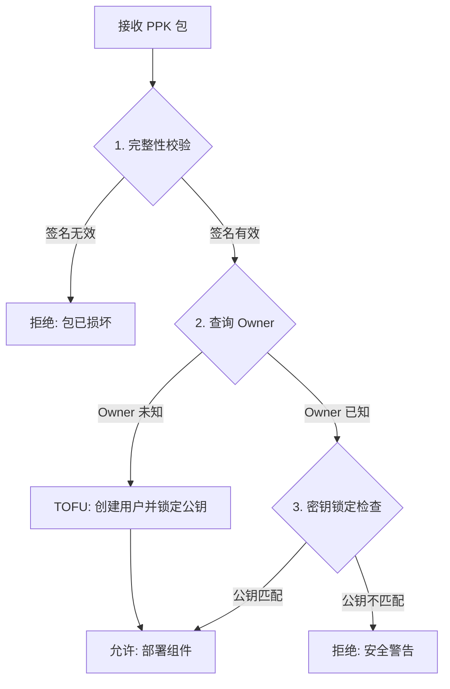

# PotStack 密钥管理与安全机制

## 概述

PotStack 采用基于 **TOFU (Trust On First Use 首次信任)** 和 **Key Pinning (密钥锁定)** 的混合信任模型，结合 **ED25519** 签名算法，确保组件包（PPK）的安全分发与更新。

本机制旨在消除对中心化 PKI 或手动分发公钥文件的依赖，同时提供强大的防篡改和防中间人攻击能力。

---

## 核心机制

### 1. 完整性校验 (Integrity)

每个 PPK 包（PotStack Package）都是一个带有自定义头部的 Zip 文件。头部包含：
- **公钥 (32 bytes)**: 用于验证签名的 ED25519 公钥。
- **签名 (64 bytes)**: 对包内容（Zip 数据）的数字签名。

**Loader 行为:**
Loader 在部署任何包之前，首先使用**包头部自带的公钥**来验证**包内容的签名**。
- 这确保了包的自洽性（Self-consistency）：内容未被篡改，且确由持有对应私钥的一方签署。
- **注意**: 这一步仅证明包的完整性，尚未验证包的来源（真实性）。

### 2. 身份认证与信任 (Authenticity & Trust)

为了解决“谁是合法发布者”的问题，PotStack 引入了基于数据库的身份锁定机制。

#### A. 首次信任 (TOFU - Trust On First Use)
当 Loader 首次遇到一个新的组件 Owner（例如 `test-org`）时：
1.  检查数据库中是否存在该 Owner 的公钥记录。
2.  若不存在，系统假定首次接收到的包是可信的。
3.  系统将该包头部中的公钥**持久化存储**到数据库的 `user` 表中 (`public_key` 字段)。
4.  该公钥从此与该 Owner 身份绑定。

#### B. 密钥锁定 (Key Pinning)
当 Loader 再次接收该 Owner 的新包（更新或新增组件）时：
1.  从数据库中读取该 Owner 已锁定的公钥。
2.  将**新包头部中的公钥**与**数据库中的锁定公钥**进行严格比对。
3.  **如果匹配**: 允许部署。
4.  **如果不匹配**: 拒绝部署并报错 (`SECURITY ERROR: Public key mismatch`)。

此机制防止了攻击者即使伪造了带有有效自签名的恶意包，也无法覆盖已锁定的合法 Owner 的组件。

---

## 工作流图示

## 优势

1. **去中心化**: 无需维护中心化的 CA 或密钥分发服务器。
2. **零配置**: 用户无需手动安装或导入公钥文件，通过首次部署自动完成信任建立。
3. **安全性**: 
   - 防止数据篡改（签名验证）。
   - 防止身份冒充（Key Pinning）。
4. **简洁性**: 移除了对外部 `.pub` 文件的依赖，PPK 包自包含所有验证所需元数据。

## 密钥丢失与轮换

由于公钥被严格锁定，若发布者丢失了私钥：
1.  **无法发布更新**: 新生成的私钥对应的公钥将无法通过 Pinning 检查。
2.  **恢复流程**: 需要管理员介入，手动更新数据库中对应用户的 `public_key` 字段，或重置该用户以触发新的 TOFU 流程。
